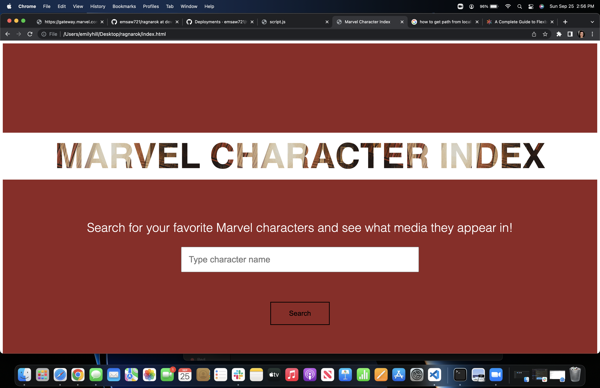
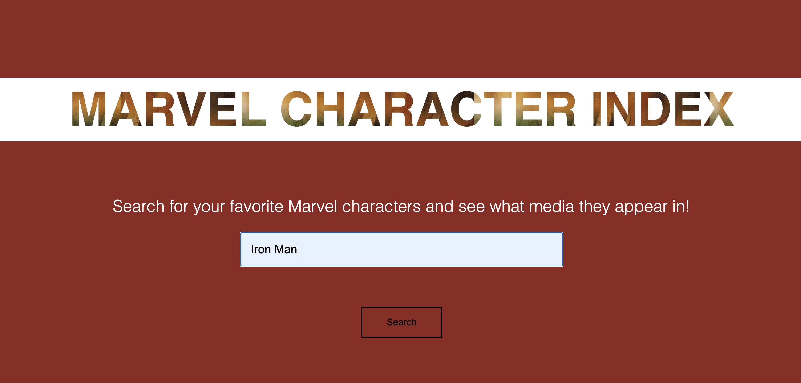

## ragnarok

## Description
<a href="https://emsaw721.github.io/ragnarok/"> Marvel Character Index </a> is an application that allows the user to look up a Marvel character and retrieve information about the searched character.  

## Usage
Marvel Character Index uses the Marvel api to call information about character appearances in movies, television, and comic books. This application also uses Google api in order to search for merchandise/youtube clips associated with the character. 

At first, the application user will see the opening page. 

Then, the user will click in the text box and enter the character for which they would like to retrieve the data. Then, they will click the search button. 

The user will see the character's data as well as any merchandise/ youtube clips associated with the character.  

The user can return to the search page by selecting the "return to homepage" link att the top left corner of the character display page. 

## Roadmap

Future iterations of this app will have 

## Authors and acknowledgment
Contributing authors to this project include Gisela Marquez (giselamarque) and Neeman Elchurafa (NeemanE). 
This README was made possible by https://www.makeareadme.com/. 

## License
[MIT](https://choosealicense.com/licenses/mit/)

